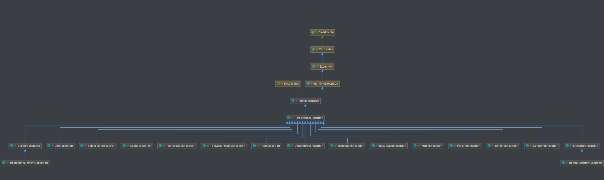

## package cn.lnd.ibatis.parsing;
解析器模块，主要提供了两个功能:
1. 一个功能，是对 XPath 进行封装，为 MyBatis 初始化时解析 mybatis-config.xml 配置文件以及映射配置文件提供支持。
2. 另一个功能，是为处理动态 SQL 语句中的占位符提供支持。

## package cn.lnd.ibatis.exceptions;
1. 定义了 MyBatis 专有的 PersistenceException 和 TooManyResultsException 异常。
2. 实际上，MyBatis 不仅仅在 exceptions 包下有异常，在其他包下也有异常，整体如下类图：
