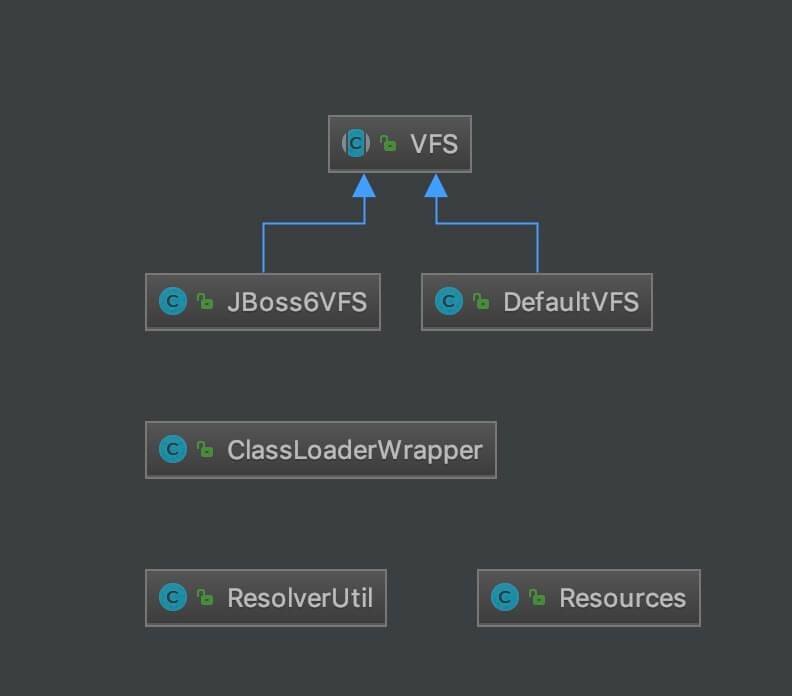

## package cn.lnd.ibatis.parsing;
解析器模块，主要提供了两个功能:
1. 一个功能，是对 XPath 进行封装，为 MyBatis 初始化时解析 mybatis-config.xml 配置文件以及映射配置文件提供支持。
2. 另一个功能，是为处理动态 SQL 语句中的占位符提供支持。

## package cn.lnd.ibatis.exceptions;
1. 定义了 MyBatis 专有的 PersistenceException 和 TooManyResultsException 异常。
2. 实际上，MyBatis 不仅仅在 exceptions 包下有异常，在其他包下也有异常。

## package cn.lnd.ibatis.transaction;
1. MyBatis 对数据库中的事务进行了抽象，其自身提供了相应的事务接口和简单实现。
2. 在很多场景中，MyBatis 会与 Spring 框架集成，并由 Spring 框架管理事务。

## cn.lnd.ibatis.io
1. 资源加载模块，主要是对类加载器进行封装，确定类加载器的使用顺序，并提供了加载类文件以及其他资源文件的功能 。
2. 本文涉及的类如下图所示：
